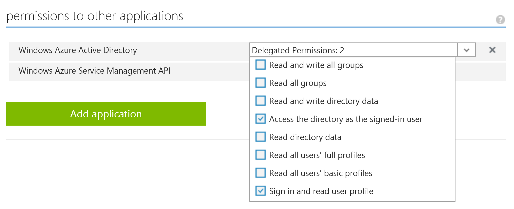
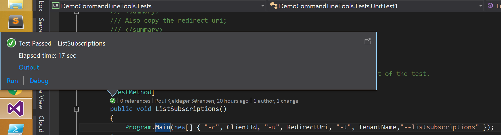


# Azure Meetup 17 / Nov Demo


## Notes from Lasse

[powerpoint](https://github.com/s-innovations/S-Innovations.Azure.Demos/raw/master/docs/Azure%20User%20Group%20-%20Azure%20Key%20Vault%2017%20nov.pptx)

[https://social.msdn.microsoft.com/Forums/azure/en-US/56bed4bd-6320-4f1f-9af5-556ae91bdf0f/storing-sql-connection-string-passwords-in-key-vault-for-my-cloud-services?forum=AzureKeyVault&prof=required](https://social.msdn.microsoft.com/Forums/azure/en-US/56bed4bd-6320-4f1f-9af5-556ae91bdf0f/storing-sql-connection-string-passwords-in-key-vault-for-my-cloud-services?forum=AzureKeyVault&prof=required)

There are multiple aspects involved in managing application config secrets well. The goal of Azure Key Vault is to help you across this entire spectrum.

    The obvious one is they need a secure storage location, with very restricted access, separate from the application source code.
    They should be available to the corresponding application without human intervention. It’s common to have apps deployed via automated pipelines these days.
    The secret owners should be able to rotate secrets without needing a full redeploy of the app. We have some customers who rotate some secrets every 20 mins!
    For some kinds of secrets, such as encryption keys, updates must preserve older versions. That is so that the application can continue to decrypt data encrypted with an older version of the key.
    The secret owner may want a log of accesses for monitoring & compliance. (This feature is not available in Key Vault yet.)
    Teams that manage multiple applications / roles / VMs benefit from managing their secrets in a consistent fashion, in a central place, as that reduces mistakes.

Your observation is spot on, that to access a key vault, an application needs a bootstrap ‘secret’ to authenticate to Azure AD. The best choice for that depends on what deployment tools you use. For most scenarios, a certificate is the best bootstrap. Azure provides mechanisms for you to store a PFX file in a safe place and inject it to your application’s VMs just when that VM spins up. Specifically

    If your application runs in VMs deployed through the new Azure Resource Manager, then see this article: http://blogs.technet.com/b/kv/archive/2015/07/14/vm_2d00_certificates.aspx
    If your application is a Cloud Service or runs in VMs deployed through the old Azure Service Manager, then see “Service certificates” in this article: https://azure.microsoft.com/en-us/documentation/articles/cloud-services-certs-create/

For this bootstrap certificate you get a subset of the benefits outlined above. For the rest of your secrets you can avail of all of the benefits outlined above by managing them via Azure Key Vault. 

In the Azure Key Vault samples [http://www.microsoft.com/en-us/download/details.aspx?id=45343](http://www.microsoft.com/en-us/download/details.aspx?id=45343) see the SampleAzureWebService sample for an example of how an application can use a certificate as bootstrap. See the script GetServiceConfigSettings.ps1 in the scripts folder for how to register the cert as the application's credential in Azure AD.


## Notes From Poul

Code have been debugged and runs. Will write detailed how to here in the coming days. 

One cool example of using the keyvault is as explained in this [blog post](http://www.dushyantgill.com/blog/2015/04/26/say-goodbye-to-key-management-manage-access-to-azure-storage-data-using-azure-ad/) where a automation job rolls the storage keys and updates the keyvault accordingly and applications automatically gets the rolled keys without redeployment.

To run the Demo in this project, clone it and open with VS 2015.  If you don’t have the latest beta 8 of tooling for websites you can just unload/remove the website project.

1. If you want to use a live id within your tenant, you should set [Unittest1.cs/L16](https://github.com/s-innovations/S-Innovations.Azure.Demos/blob/master/tests/DemoCommandLineTools.Tests/UnitTest1.cs#L16) to your tenant name, other wise use "common"
2. Create a Application within your add as a native application, in the app permissions - ensure you have enabled the azure management api and also the user_impersonation part of graph api.
 
3. Add the clientId of your devops application (the native application do not have secrets and can be used to delegate access on behalf of the signed in user using ADAL, which is you - so the account you sign in with should have access to your subscriptions.) [Unittest1.cs/L23](https://github.com/s-innovations/S-Innovations.Azure.Demos/blob/master/tests/DemoCommandLineTools.Tests/UnitTest1.cs#L23)
4. Set the redirect Uri also : [Unittest1.cs/L28](https://github.com/s-innovations/S-Innovations.Azure.Demos/blob/master/tests/DemoCommandLineTools.Tests/UnitTest1.cs#L28)
5. To get your subscription id you can use the first unit test method to call the console application, and using the debugger you can step through and see how you can use the management libraries. [Unittest1.cs/L36](https://github.com/s-innovations/S-Innovations.Azure.Demos/blob/master/tests/DemoCommandLineTools.Tests/UnitTest1.cs#L36)
6. When right clicking the unit tests and run, you can read the results from console as shown in the image:

7. [Unittest1.cs/L50](https://github.com/s-innovations/S-Innovations.Azure.Demos/blob/master/tests/DemoCommandLineTools.Tests/UnitTest1.cs#L50) Lists any keyvaults you may have on your subscription.
8. [Unittest1.cs/L53](https://github.com/s-innovations/S-Innovations.Azure.Demos/blob/master/tests/DemoCommandLineTools.Tests/UnitTest1.cs#L53) Now set the resource group name and location to be used in the demo, it will create it when needed if it do not exists.
9. [Unittest1.cs/L62](https://github.com/s-innovations/S-Innovations.Azure.Demos/blob/master/tests/DemoCommandLineTools.Tests/UnitTest1.cs#L62) You can use this to create a keyvault and also give an application access to it. Here you want to create another application (website/api) that is the identity of your application. 
10. [Unittest1.cs/L78](https://github.com/s-innovations/S-Innovations.Azure.Demos/blob/master/tests/DemoCommandLineTools.Tests/UnitTest1.cs#L78)  If you already have a keyvault and a application you can use this to associate the two. (To modify the permissions you have to step into the code and see where they are set, currently they are set to "all")

### Deploy 
The above steps was to get started and work with keyvaults. The next unit test instructs the command line tool to deploy a hosting plan, website, application insight, storage account and also a keyvault. 
When the ARM template deployment completes, it will read the output that have the storage account name and keyvault name that was uniquely generated in the template and reads the storage account keys and add them to the keyvault. 

#### DISCLAIMER 
I havent been able to get KUDO (azure websites) to build the website due to aspnet 5 templates. If someone runs the deployment and finds out what needs to be modified for the build step to work, ping me on twitter @pksorensen

[Unittest1.cs/L78](https://github.com/s-innovations/S-Innovations.Azure.Demos/blob/master/tests/DemoCommandLineTools.Tests/UnitTest1.cs#L78)  If you already have a keyvault and a application you can use this to associate the two. (To modify the permissions you have to step into the code and see where they are set, currently they are set to "all")
```
        [TestMethod]
        public void Deploy()
        {

            var template = @"..\..\..\src\AzureKeyVaultDemo.Deploy\Templates\WebSite.json";
            var websiteName = ResourceGroupName + "-website";
            var websitePlan = "Free";
            var StorageAccountType = "Standard_LRS";
            var hostingPlanName = ResourceGroupName + "-plan";
            var deployName = ResourceGroupName + "-deployment";
            var appId = "fb4fbba5-6fac-404e-b7b6-d7bf4b56a7ea";

            Program.Main(new[] {"-c", ClientId, "-u", RedirectUri, "-s", SubscriptionId, "-t", TenantName, "-r", ResourceGroupName,
                "--location", Location, "--deploy", template,"--deployName", deployName,
                "--siteName", websiteName,"--websitePlan",websitePlan,"--storageAccountType",StorageAccountType,
                "--hostingPlanName",hostingPlanName, "--applicationId",appId});
            
        }
```

We are not going to use the website for the rest of the demo, but instead use the unit test project to show how you can use the keyvault in your applications.

### Certificates, lets do it the right way and not store our secrets insecurely.

You should now read the output of the deploy unit test to get the keyvault name and set it here: [Unittest1.cs/L113](https://github.com/s-innovations/S-Innovations.Azure.Demos/blob/master/tests/DemoCommandLineTools.Tests/UnitTest1.cs#L113) 
Since the storage account keys are in the keyvault already we need to set up such a website or as in this case the unit test project can ask the azure ad for a token and read the storage account keys.

[Unittest1.cs/L127](https://github.com/s-innovations/S-Innovations.Azure.Demos/blob/master/tests/DemoCommandLineTools.Tests/UnitTest1.cs#L127) will create a certificate, and store it in your keyvault as a secret and not as a key. When you put it in as a key, you cannot extract it again but only ask the keyvault to do operations with the certificate. We simply want to store it securely behind our work or microsoft account identities which is behind two factor authentication :)
```
        [TestMethod]
        public void CreateCert()
        {
          
            var certname = "azure-keyvault-demo";
          
            Program.Main(new[] { "-c", ClientId, "-u", RedirectUri, "-s", SubscriptionId, "-t", TenantName, "-r", ResourceGroupName ,
                "--vault", VaultName, "--MakeCert", "--CertificateName", certname});

        }
```

Notice the certname will be used for the secret name. In the next step you will extract the certification from the keyvault to install it on your own machine (for test purpose). In production we have deployment scripts that install these certificates on the cloud service roles and the next step would be to add them to azure websites also as part of the deployment. Install the certificate in the local machine.
[Unittest1.cs/L132](https://github.com/s-innovations/S-Innovations.Azure.Demos/blob/master/tests/DemoCommandLineTools.Tests/UnitTest1.cs#L132)
```
        /// <summary>
        /// We can export it to file system if we really need it, but hey lets try to not store these things on your laptops using a empty password :)
        /// </summary>
        [TestMethod]
        public void ExportCert()
        {

      
            var certname = "azure-keyvault-demo";
            var location = "c:\\dev\\" + certname + ".pfx";

            Program.Main(new[] { "-c", ClientId, "-u", RedirectUri, "-s", SubscriptionId, "-t", TenantName, "-r", ResourceGroupName,
                "--ExportCert", certname, "--vault", VaultName, "-o", location });

        }
```

The reason that we need a certificate is that we are going to encrypt the application secret that you now will create on manage.windowsazure.com for your website application.
Using [Unittest1.cs/L148](https://github.com/s-innovations/S-Innovations.Azure.Demos/blob/master/tests/DemoCommandLineTools.Tests/UnitTest1.cs#L148) you can copy in your secret from azure AD and read the encrypted value from the test output. To decrypt the value again the machines needs to have the certificate installed or you can use the decrypt unit test also in the project.
```
         /// <summary>
        /// We can encrypt a value with the just stored secret
        /// </summary>
        [TestMethod]
        public void EncryptValue()
        {
          
            var certname = "azure-keyvault-demo";           
            var value = "mysecretkey";

            Program.Main(new[] { "-c", ClientId, "-u", RedirectUri, "-s", SubscriptionId, "-t", TenantName, "-r", ResourceGroupName,
                "--vault", VaultName, "--CertificateName", certname, "--encrypt", value });

            

        }
```

### Last Step, the test and how to use the configuration manager

[Unittest2.cs](https://github.com/s-innovations/S-Innovations.Azure.Demos/blob/master/tests/DemoCommandLineTools.Tests/UnitTest2.cs#) has the final test that can be used in production. In the website project I have configured MVC 5 to use my configuration manager [here](https://github.com/s-innovations/S-Innovations.Azure.Demos/blob/master/src/AzureKeyVaultDemo/Startup.cs#L40) and its used [here](https://github.com/s-innovations/S-Innovations.Azure.Demos/blob/master/src/AzureKeyVaultDemo/api/Controllers/ValuesController.cs#L57)
```
[TestClass]
    public class UnitTest2
    {
        public static string DecryptEnvelop(string base64EncryptedString)
        {
            var encryptedBytes = Convert.FromBase64String(base64EncryptedString);
            var envelope = new EnvelopedCms();
            envelope.Decode(encryptedBytes);
            var store = new X509Store(StoreName.My, StoreLocation.LocalMachine);
            store.Open(OpenFlags.ReadOnly);
            envelope.Decrypt(store.Certificates);
            return Encoding.UTF8.GetString(envelope.ContentInfo.Content);
        }

        [TestMethod]
        public void TestMethod1()
        {

            var configurationManager = new ConfigurationManager(new AppSettingsProvider());
            configurationManager.UseAzureKeyVault(
                new AzureKeyVaultSettingsProviderOptions
                {
                    ConfigurationManager = configurationManager,
                    SecretConverter = DecryptEnvelop
                });
            
            var test = configurationManager.GetAzureKeyVaultSecret("storage");
            Console.WriteLine(test.Value);

        }

      
    }
```

and to make this work you only need to have the following app settings:
```
  <appSettings>
    <add key="Azure.KeyVault.Uri" value="https://vwzdgctm7ywb6.vault.azure.net/" />
    <add key="Microsoft.Azure.AD.Application.ClientId" value="fb4fbba5-6fac-404e-b7b6-d7bf4b56a7ea" />
    <add key="Microsoft.Azure.AD.Application.ClientSecret" value="MIIBvQYJKoZIhvcNAQcDoIIBrjCCAaoCAQAxggFOMIIBSgIBADAyMB4xHDAaBgNVBAMTE2F6dXJlLWtleXZhdWx0LWRlbW8CEEilhJ3CxxOhQGFWdRaUCMwwDQYJKoZIhvcNAQEBBQAEggEAOSk7ppLRW8XQDcatbNMg75qauPD4oil/Iy6OHjo2zNCo4bSiTdy2JIe1tRpZfLb7OkN/Rre5SZLW4dKOhwp27BnrhNRz7d1kzAG2Ld3D07/L2HINaCPDCmwWoCI/d/ENyh7PHMg07pcxtzBpfUVuwfRm//0TXtadPtUnQ0IJv66fHotr/ABur3it7FhqVf5/DLXBAf6veMEHS5mN6+P1vziAFrVOsxNsICP2Y71PdimckDtdNEPg8+rDzuB1/EYk5fa+qFwNIzGGu8QgNy/z88GH1OvKseKTpDw5iYqrKcq7PLjnWHr/w/tbToh6j0D2X+dB4ehbgMoW7F1HIzbrGzBTBgkqhkiG9w0BBwEwFAYIKoZIhvcNAwcECJ4/8uSahbrkgDDuZfV3HXZl1NJBtMD1ghgmUoQSDAZjBF9/HUNJTt6nAmuKtyyeXCu2alqoNpAxmig=" />
  </appSettings>
```

where the clientID is the application id of your website (not the devops application we used for the unit test project) and the ClientSecret is the encryptet secret that can only be decrypted with the certificate installed and last, the keyvault uri.


